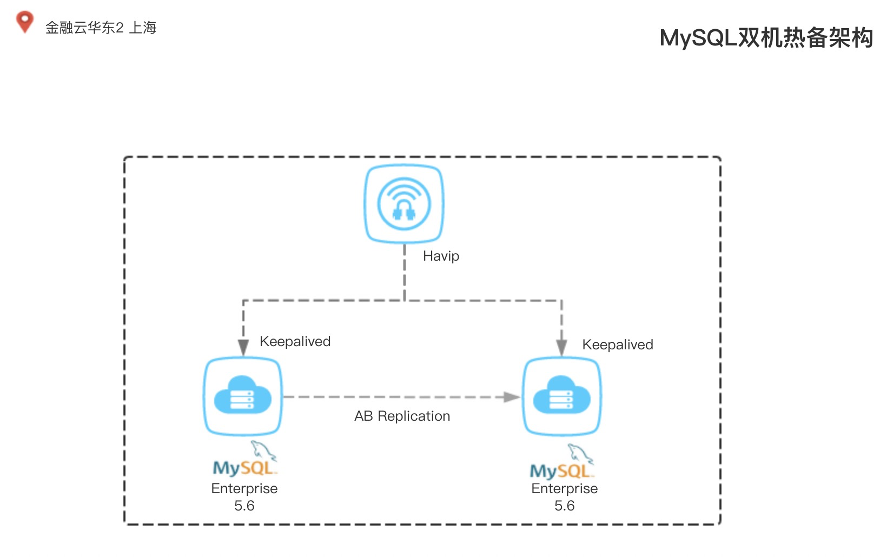

# MySQL5.6双机热备高可用方案配置手册

> * Author: BooBooWei
> * Version: V.2019.08.08
> * Descrition: MySQLHA-Keepalived-2Nodes

[TOC]

<div style="page-break-after: always;"></div>
# 概述

## 方案说明

`MySQL`双机热备是一种只有两个节点的高可用集群。高可用性`>=99.95%`，一年内累计不能超过`4`个小时的不可服务时间。

基于`MySQL 5.6 `的半同步复制 `Semisynchronous Replication`，加` Keepalived` 构建的高可用结构 。

集群中两台服务器互为备份，当一台服务器出现故障时，可由另一台服务器承担服务任务，从而在无人工干预的情况下，自动保证系统能持续对外提供服务。



| 技术                   | 说明                                                         |
| ---------------------- | ------------------------------------------------------------ |
| `MySQL AB Replication` | `MySQL`官方主从复制技术是一种非常简单、便捷的解决方案，在高可用集群中，`MySQL`主从保证两台`MySQL` 数据的一致性 |
| `Keepalived`           | 实现`MySQL`故障时的自动切换                                  |
| `Havip`                | 阿里云产品，利用可在`ECS`进行私网`IP`宣告的功能，可以实现`VRR`P协议的高可用 |

<div style="page-break-after: always;"></div>
## 环境说明

| HOSTNAME | IP               | PORT   | ROLE     |
| -------- | ---------------- | ------ | -------- |
| `node1`  | `192.168.14.128` | `3306` | `Master` |
| `node2`  | `192.168.14.129` | `3306` | `Slave`  |
| `vip`    | `192.168.14.88`  |        |          |

## 软件版本

| 软件         | 版本   | 软件包                                       | 官网                                                         |
| ------------ | ------ | -------------------------------------------- | ------------------------------------------------------------ |
| `MySQL`      | 5.6    | `mysql-5.6.45-linux-glibc2.12-x86_64.tar.gz` | [MySQL](https://dev.mysql.com/downloads/mysql/5.6.html#downloads) |
| `KeepAlived` | 2.0.18 | `keepalived-2.0.18.tar.gz`                   | [Keepalived](https://www.keepalived.org/doc/installing_keepalived.html) |

## 自动安装配置脚本

联系驻云DBA

<div style="page-break-after: always;"></div>
# MySQL 主从搭建

## 主机配置

### 双机hosts文件配置

双机`hosts`文件配置，需要在两台主机上分别修改`/etc/hosts`文件，如下所示：

```bash
192.168.14.128 node1
192.168.14.129 node2
```

### 双机NTP时钟同步

生产环境要求主备机，必须进行时钟同步。

### 双机互信配置

`node1`上执行：

```bash
ip=192.168.14.129
yes | ssh-keygen -f $HOME/.ssh/id_rsa -t rsa -N ''
ssh-copy-id root@$ip
```

`node2`上执行：

```bash
ip=192.168.14.128
yes | ssh-keygen -f $HOME/.ssh/id_rsa -t rsa -N ''
ssh-copy-id root@$ip
```

验证：

```bash
ssh root@$ip hostname
```

不需要使用密码则说明配置成功。

<div style="page-break-after: always;"></div>
## 数据库配置

### 数据库基础安装

运行`mysql-5.6.46.sh`安装脚本

配置文件中有以下参数需要提前与客户确认：

1. 字符集，默认`utf8mb4`
2. 事务隔离级别，默认`RC`

```config
cat > /etc/my.cnf <<END
#my.cnf
[client]
port            = 3306
socket          = /tmp/mysql3306.sock

[mysql]
prompt="\\u@\\h [\\d]>"
no-auto-rehash

[mysqld]

user = mysql
basedir = /alidata/mysql
datadir = /alidata/mysql/data
port = 3306
socket = /tmp/mysql3306.sock
event_scheduler = 0

tmpdir = /alidata/mysql/tmp
#timeout
interactive_timeout = 28800
wait_timeout = 28800

#character set
character-set-server = utf8mb4

open_files_limit = 65535
max_connections = 1000
max_connect_errors = 100000
lower_case_table_names =1

#symi replication

#rpl_semi_sync_master_enabled=1
#rpl_semi_sync_master_timeout=1000 # 1 second
#rpl_semi_sync_slave_enabled=1

#logs
log-output=file
slow_query_log = 1
slow_query_log_file = /alidata/mysql/data/slow.log
log-error = /alidata/mysql/data/error.log
log_warnings = 2
pid-file = mysql.pid
long_query_time = 1
#log-slow-admin-statements = 1
#log-queries-not-using-indexes = 1
log-slow-slave-statements = 1

#binlog
binlog_format = row
server-id = 2003306
log-bin = /alidata/mysql/log/mysql-bin
binlog_cache_size = 4M
sync_binlog = 1
expire_logs_days = 10
#procedure
log_bin_trust_function_creators=1

# gtid
gtid-mode = on
enforce-gtid-consistency=1


#relay log
skip_slave_start = 1
max_relay_log_size = 128M
relay_log_purge = 1
relay_log_recovery = 1
relay-log=relay-bin
relay-log-index=relay-bin.index
log_slave_updates
#slave-skip-errors=1032,1053,1062
#skip-grant-tables


#buffers & cache
table_open_cache = 2048
table_definition_cache = 2048
table_open_cache = 2048
max_heap_table_size = 96M
sort_buffer_size = 128K
join_buffer_size = 128K
thread_cache_size = 200
query_cache_size = 0
query_cache_type = 0
query_cache_limit = 256K
query_cache_min_res_unit = 512
thread_stack = 192K
tmp_table_size = 96M
key_buffer_size = 8M
read_buffer_size = 2M
read_rnd_buffer_size = 16M
bulk_insert_buffer_size = 32M

#myisam
myisam_sort_buffer_size = 128M
myisam_max_sort_file_size = 10G
myisam_repair_threads = 1

#innodb
innodb_buffer_pool_size = $(num1=`cat /proc/meminfo | sed -n '1p'|awk '{print $2}'`;awk 'BEGIN{printf "%.0f\n",'$num1'*1024*0.75}')
innodb_buffer_pool_instances = 8
innodb_buffer_pool_load_at_startup = 1
innodb_buffer_pool_dump_at_shutdown = 1
innodb_data_file_path = ibdata1:1G:autoextend
innodb_flush_log_at_trx_commit = 1
innodb_log_buffer_size = 32M
innodb_log_file_size = 2G
innodb_log_files_in_group = 2

# mem bug
performance_schema_max_table_instances=600


[mysqldump]
quick
max_allowed_packet = 32M

END
```


<div style="page-break-after: always;"></div>
### 数据库安全加固

1. 修改root用户密码
2. 清除所有不安全账号

```bash
mysql_bin=/alidata/mysql/bin/
root_pwd=Zyadmin123
keepalived_user=keepalived
keepalived_pwd=Keepalived@123
${mysql_bin}/mysqladmin -uroot password $root_pwd
${mysql_bin}/mysql -uroot -p$root_pwd -e "delete from mysql.user where user='' or host='' or password='';"
${mysql_bin}/mysql -uroot -p$root_pwd -e "grant all on *.* to '${keepalived_user}'@'%' identified by '${keepalived_pwd}';"
```


### 半同步复制配置

```bash
install plugin rpl_semi_sync_master soname 'semisync_master.so';
install plugin rpl_semi_sync_slave soname 'semisync_slave.so';

rpl_semi_sync_master_enabled=1
rpl_semi_sync_master_timeout=1000 # 1 second
rpl_semi_sync_slave_enabled=1
```


主库：


```shell
mysql_bin=/alidata/mysql/bin/
root_pwd=Zyadmin123
${mysql_bin}/mysql -uroot -p$root_pwd -e "install plugin rpl_semi_sync_master soname 'semisync_master.so';"
${mysql_bin}/mysql -uroot -p$root_pwd -e "install plugin rpl_semi_sync_slave soname 'semisync_slave.so';"
${mysql_bin}/mysql -uroot -p$root_pwd -e "set global sync_binlog=1;set global innodb_flush_log_at_trx_commit=1;"
sed -i "s/^server-id.*$/server_id=1003306/" /etc/my.cnf
sed -i "s/#rpl_semi_sync_master_enabled=1/rpl_semi_sync_master_enabled=1/" /etc/my.cnf
sed -i "s/#rpl_semi_sync_master_timeout=1000 # 1 second/rpl_semi_sync_master_timeout=1000 # 1 second/" /etc/my.cnf
sed -i "s/#rpl_semi_sync_slave_enabled=1/rpl_semi_sync_slave_enabled=1/" /etc/my.cnf
```

从库：

```bash
mysql_bin=/alidata/mysql/bin/
root_pwd=Zyadmin123
${mysql_bin}/mysql -uroot -p$root_pwd -e "install plugin rpl_semi_sync_master soname 'semisync_master.so';"
${mysql_bin}/mysql -uroot -p$root_pwd -e "install plugin rpl_semi_sync_slave soname 'semisync_slave.so';"
${mysql_bin}/mysql -uroot -p$root_pwd -e "set global sync_binlog=0;set global innodb_flush_log_at_trx_commit=0;"
sed -i "s/^server-id.*$/server_id=2003306/" /etc/my.cnf
sed -i "s/#rpl_semi_sync_master_enabled=1/rpl_semi_sync_master_enabled=1/" /etc/my.cnf
sed -i "s/#rpl_semi_sync_master_timeout=1000 # 1 second/rpl_semi_sync_master_timeout=1000 # 1 second/" /etc/my.cnf
sed -i "s/#rpl_semi_sync_slave_enabled=1/rpl_semi_sync_slave_enabled=1/" /etc/my.cnf
```

## 服务启动和停止命令

```bash
/etc/init.d/mysqld start
/etc/init.d/mysqld stop
/etc/init.d/mysqld restart
```

<div style="page-break-after: always;"></div>
## 自定义脚本

### 脚本语言和版本

| 语言     | 版本    |
| -------- | ------- |
| `Python` | `2.7.4` |

```bash
#!/bin/bash

install_epel(){
	cd /aliyun/install
	rpm -ivh epel-release-latest-7.noarch.rpm
	yum clean all
	yum make cache
}

python_reqiure(){
	yum install -y python-pip  python-devel
	pip install --upgrade pip
	pip install pymysql
	pip install filelock
}

install_epel
python_reqiure
```

<div style="page-break-after: always;"></div>
### 数据库健康检查

`check_mysql.py` 为了检查数据库服务是否正常的脚本，如果判断服务异常，则自动把`keepalived`进程`kill`，让`VIP`进行漂移;

#### 检测算法

1. 判断数据库是否能够正常连接
2. 判断监听端口为3306的`mysqld_safe`进程是否存在
3. 判断监听端口是否存在

若 数据库能够正常连接 ；则 返回数据正常;

否则 判断进程和端口是否存在：

* 若此时进程和端口均存在，则连续check 5次 数据库连接情况是否正常，每次check后等待1秒；若5次check后都无法正常连接数据库，则返回数据库异常；若在完成5次check前恢复数据库连接，则返回数据库正常。
* 若此时进程不存在  or 监听端口 不存在 ；则直接返回数据库异常；

#### 检测脚本

##### config.py

```python
#!/usr/bin/python

dbhost='192.168.14.131'
dbport=3306
dbuser='keepalived'
dbpassword='Keepalived@123'
log_dir="/alidata//keepalived-2.0.18/logs"
other_node='192.168.14.132'
```

##### mysql_helper.py

```python
# -*- coding:utf8 -*-

import sys
import pymysql
import json


class MysqlHelper:
    def __init__(self, **kwargs):
        self.url = kwargs['url']
        self.port = kwargs['port']
        self.username = kwargs['username']
        self.password = kwargs['password']
        self.dbname = kwargs['dbname']
        self.charset = "utf8"
        self.conn = pymysql.connect(host=self.url, user=self.username, passwd=self.password, port=self.port,
                                    charset=self.charset, db=self.dbname)
        self.cur = self.conn.cursor(cursor=pymysql.cursors.DictCursor)

    def col_query(self, sql):
        """
        打印表的列名
        :return list
        """
        self.cur.execute(sql)
        return self.cur.fetchall()

    def commit(self):
        self.conn.commit()

    def close(self):
        self.cur.close()
        self.conn.close()

if __name__ == "__main__":
    print("This is mysql api.")
```

##### check_mysql.py

```python
#!/usr/bin/python
# coding: utf-8

import time
import sys
import os
import logging
import json

# Third-part
import mysql_helper
import filelock
import config

preSlaveSQL = "set global read_only=1;"
preMasterSQL = "set global read_only=0;"
log_dir = config.log_dir

logging.basicConfig(level=logging.DEBUG,
                    format='%(asctime)s %(filename)s[line:%(lineno)d] %(levelname)s %(message)s',
                    datefmt='%a, %d %b %Y %H:%M:%S',
                    filename='{0}/notify.log'.format(log_dir),
                    filemode='a',
                    maxBytes=10485760,  # 10MB 设置日志文件的大小
                    backupCount=20,  # 文件最大的个数
                    encoding='utf8')


class DBase:
    def __init__(self, **kwargs):
        self.params = kwargs["mysql"]
        self.keepalived = kwargs["keepalived"]
        self.other_node = kwargs["other_node"]
        try:
            self.conn = mysql_helper.MysqlHelper(**self.params)
        except Exception as e:
            logging.info("数据库连接异常 " + str(e))
            exit(1)

    def alert(self):
        print("{}".format(self.keepalived))

    def make_master(self):
        """
        将从库切换为主库
        1. 获取从库slave状态
        2. 判断主从是否存在延迟
        3. 如存在延迟等待1分钟
        4. 停止slave
        :return:
        """
        slave_status = self.conn.col_query("show slave status")[0]
        logging.info(json.dumps(slave_status, indent=2))
        Master_Host = slave_status["Master_Host"]
        Master_Log_File = slave_status["Master_Log_File"]
        Read_Master_Log_Pos = slave_status["Read_Master_Log_Pos"]
        Relay_Master_Log_File = slave_status["Relay_Master_Log_File"]
        Exec_Master_Log_Pos = slave_status["Exec_Master_Log_Pos"]

        if Master_Log_File == Relay_Master_Log_File and Read_Master_Log_Pos == Exec_Master_Log_Pos:
            self.conn.col_query("stop slave;")
            self.conn.col_query("set global sync_binlog=1;")
            self.conn.col_query("set global innodb_flush_log_at_trx_commit=1;")
            self.conn.col_query("set global read_only=0;")
            master_status = self.conn.col_query("show master status;")[0]
            logging.info("stop slave;show master status;")
            logging.info("记录新主库的binlog位置：")
            logging.info(json.dumps(master_status, indent=2))
            with open("/alidata/keepalived-2.0.18/logs/master_info", 'w') as f:
                f.write(json.dumps(master_status, indent=1))

        else:
            time.sleep(60)
            slave_status = self.conn.col_query("show slave status")[0]
            logging.info(json.dumps(slave_status, indent=2))
            self.conn.col_query("stop slave;")
            self.conn.col_query("set global sync_binlog=1;")
            self.conn.col_query("set global innodb_flush_log_at_trx_commit=1;")
            self.conn.col_query("set global read_only=0;")
            master_status = self.conn.col_query("show master status;")[0]
            logging.info(json.dumps(master_status, indent=2))
            with open("/alidata/keepalived-2.0.18/logs/master_info", 'w') as f:
                f.write(json.dumps(master_status, indent=1))

        # 记录主库真实的binlog文件和position编号
        try:
            os.popen(
                "scp root@{0}:/alidata/mysql/log/mysql-bin.index /alidata/keepalived-2.0.18/logs/{0}-mysql-bin.index".format(
                    Master_Host))
            master_binlog_file_real = \
                open("/alidata/keepalived-2.0.18/logs/{0}-mysql-bin.index".format(Master_Host)).readlines()[-1].strip()
            os.popen(
                "scp root@{0}:{1}  /alidata/keepalived-2.0.18/logs/{0}-{2}".format(Master_Host, master_binlog_file_real,
                                                                                   master_binlog_file_real.split('/')[
                                                                                       -1]))
            master_binlog_file_slave = "/alidata/keepalived-2.0.18/logs/{0}-{1}".format(Master_Host,
                                                                                        master_binlog_file_real.split(
                                                                                            '/')[-1])
            cmd = "/alidata/mysql/bin/mysqlbinlog -vv " + master_binlog_file_slave + " | tail -n 100|grep end_log_pos|tail -n 2|head -n 1|awk '{print $7}'"
            master_binlog_pos_real = os.popen(cmd).read()
        except Exception as e:
            logging.error(str(e))

        else:
            logging.info("主库 {0} 最后一个binlog日志文件 {1}  位置编号为 {2}".format(Master_Host, master_binlog_file_real,
                                                                       master_binlog_pos_real))
            logging.info("从库 {0} 重演主库binlog日志文件 {1}  位置编号为 {2}".format(
                self.params["url"],
                slave_status["Relay_Master_Log_File"],
                slave_status["Exec_Master_Log_Pos"]))

    def make_slave(self):
        """
        清空slave配置，重新获取远程日志文件及位置编号，并开启半同步复制；
        :return:
        """
        try:
            os.popen(
                "scp root@{0}:/alidata/keepalived-2.0.18/logs/master_info /alidata/keepalived-2.0.18/logs/{0}-master_info".format(
                    self.other_node))
            master_info = json.loads(
                open("/alidata/keepalived-2.0.18/logs/{0}-master_info".format(self.other_node)).read())
        except Exception as e:
            logging.error("无法获取远程日志文件及位置编号")
            logging.error(str(e))
        else:
            self.conn.col_query("stop slave;")
            logging.info("stop slave;")
            sql = "change master to master_user='slave',master_password='Slave@replication',master_host='{0}',master_auto_position=0;"
            self.conn.col_query(sql)
            logging.info(sql)
            sql = "change master to master_user='slave',master_password='Slave@replication',master_host='{0}',master_log_file='{1}',master_log_pos={2};".format(
                self.other_node, master_info["File"], master_info["Position"])
            self.conn.col_query(sql)
            self.conn.col_query("start slave;")
            self.conn.col_query("set global read_only=1;")
            logging.info("start slave;")
            logging.info("set global read_only=1;")
            logging.info(sql)
            slave_status = self.conn.col_query("show slave status;")[0]
            logging.info(json.dumps(slave_status, indent=2))

    def stop_mysql(self):
        try:
            master_status = self.conn.col_query("show master status;")[0]
        except:
            logging.error("数据库服务异常")
        else:
            logging.info("数据库正常")
            logging.info(json.dumps(master_status, indent=2))
            logging.info("主库 {0} 最后一个binlog日志文件 {1}  位置编号为 {2}".format(
                self.params["url"], master_status["File"], master_status["Position"]))


        try:
            slave_status = self.conn.col_query("show slave status;")[0]
        except:
            logging.error("数据库服务异常")
        else:
            logging.info("数据库正常")
            logging.info(json.dumps(slave_status, indent=2))
            logging.info("从库 {0} 重演主库binlog日志文件 {1}  位置编号为 {2}".format(
                self.params["url"],
                slave_status["Relay_Master_Log_File"],
                slave_status["Exec_Master_Log_Pos"]))

    def start(self):
        if self.keepalived == "MASTER":
            self.make_master()
            logging.info("切换状态为MASTER")
        elif self.keepalived == "BACKUP":
            self.make_slave()
            logging.info("切换状态为BACKUP")
        elif self.keepalived == "STOP":
            self.stop_mysql()
            logging.info("切换状态为STOP")
        else:
            logging.error("keepalived配置有误或脚本执行异常")

        self.conn.close()


if __name__ == "__main__":
    lock = filelock.FileLock("/tmp/kps.txt")
    if lock:
        logging.info("ZST Get Lock.start!!!")
    try:
        with lock.acquire(timeout=5):
            pass
    except filelock.timeout:
        print "timeout"
        logging.warning("get file lock timeout")

    mysql = {
        "url": config.dbhost,
        "port": config.dbport,
        "username": config.dbuser,
        "password": config.dbpassword,
        "dbname": "mysql",
    }

    params = {
        "mysql": mysql,
        "keepalived": sys.argv[3].upper(),
        "other_node": config.other_node,
    }

    db = DBase(**params)
    db.start()
```

<div style="page-break-after: always;"></div>
### 数据库角色切换

#### 算法

* 如果参数为`backup`，则调用`make_slave()`函数：清空slave配置，重新获取远程日志文件及位置编号，并开启半同步复制，`set global read_only=1;`；
* 如果参数为`master`，则调用`make_master()`函数：先判断同步复制是否执行完成，如果未执行完成等待1分钟后，停止同步（stop slave;），并且记录切换后的日志和位置编号，`set glbal read_only=0`；
* 如果参数为`stop`，则调用`stop_mysql()`函数：记录当前主或从的日志信息，为故障修复做准备；
* 如果参数为`fault`，则调用`alert()函数`：`keepalived`本身配置或调用的脚本执行异常，记录异常。

#### notify.py

```python
#!/usr/bin/python
# coding: utf-8

import time
import sys
import os
import logging
import json

# Third-part
import mysql_helper
import filelock
import config

preSlaveSQL = "set global read_only=1;"
preMasterSQL = "set global read_only=0;"
log_dir = config.log_dir

logging.basicConfig(level=logging.DEBUG,
                    format='%(asctime)s %(filename)s[line:%(lineno)d] %(levelname)s %(message)s',
                    datefmt='%a, %d %b %Y %H:%M:%S',
                    filename='{0}/notify.log'.format(log_dir),
                    filemode='a',
                    maxBytes=10485760,  # 10MB 设置日志文件的大小
                    backupCount=20,  # 文件最大的个数
                    encoding='utf8')


class DBase:
    def __init__(self, **kwargs):
        self.params = kwargs["mysql"]
        self.keepalived = kwargs["keepalived"]
        self.other_node = kwargs["other_node"]
        try:
            self.conn = mysql_helper.MysqlHelper(**self.params)
        except Exception, e:
            logging.info("数据库连接异常 " + str(e))
            exit(1)

    def alert(self):
        print("{}".format(self.keepalived))

    def make_master(self):
        """
        将从库切换为主库
        1. 获取从库slave状态
        2. 判断主从是否存在延迟
        3. 如存在延迟等待1分钟
        4. 停止slave
        :return:
        """
        slave_status = self.conn.col_query("show slave status")[0]
        logging.info(json.dumps(slave_status, indent=2))
        Master_Host = slave_status["Master_Host"]
        Master_Log_File = slave_status["Master_Log_File"]
        Read_Master_Log_Pos = slave_status["Read_Master_Log_Pos"]
        Relay_Master_Log_File = slave_status["Relay_Master_Log_File"]
        Exec_Master_Log_Pos = slave_status["Exec_Master_Log_Pos"]

        if Master_Log_File == Relay_Master_Log_File and Read_Master_Log_Pos == Exec_Master_Log_Pos:
            self.conn.col_query("stop slave;")
            self.conn.col_query("set global sync_binlog=1;")
            self.conn.col_query("set global innodb_flush_log_at_trx_commit=1;")
            self.conn.col_query("set global read_only=0;")
            master_status = self.conn.col_query("show master status;")[0]
            logging.info("stop slave;show master status;")
            logging.info("记录新主库的binlog位置：")
            logging.info(json.dumps(master_status, indent=2))
            with open("/alidata/keepalived-2.0.18/logs/master_info", 'w') as f:
                f.write(json.dumps(master_status, indent=1))

        else:
            time.sleep(60)
            slave_status = self.conn.col_query("show slave status")[0]
            logging.info(json.dumps(slave_status, indent=2))
            self.conn.col_query("stop slave;")
            self.conn.col_query("set global sync_binlog=1;")
            self.conn.col_query("set global innodb_flush_log_at_trx_commit=1;")
            self.conn.col_query("set global read_only=0;")
            master_status = self.conn.col_query("show master status;")[0]
            logging.info(json.dumps(master_status, indent=2))
            with open("/alidata/keepalived-2.0.18/logs/master_info", 'w') as f:
                f.write(json.dumps(master_status, indent=1))

        # 记录主库真实的binlog文件和position编号
        try:
            os.popen(
                "scp root@{0}:/alidata/mysql/log/mysql-bin.index /alidata/keepalived-2.0.18/logs/{0}-mysql-bin.index".format(
                    Master_Host))
            master_binlog_file_real = \
                open("/alidata/keepalived-2.0.18/logs/{0}-mysql-bin.index".format(Master_Host)).readlines()[-1].strip()
            os.popen(
                "scp root@{0}:{1}  /alidata/keepalived-2.0.18/logs/{0}-{2}".format(Master_Host, master_binlog_file_real,
                                                                                   master_binlog_file_real.split('/')[
                                                                                       -1]))
            master_binlog_file_slave = "/alidata/keepalived-2.0.18/logs/{0}-{1}".format(Master_Host,
                                                                                        master_binlog_file_real.split(
                                                                                            '/')[-1])
            cmd = "/alidata/mysql/bin/mysqlbinlog -vv " + master_binlog_file_slave + " | tail -n 100|grep end_log_pos|tail -n 2|head -n 1|awk '{print $7}'"
            master_binlog_pos_real = os.popen(cmd).read()
        except Exception as e:
            logging.error(str(e))

        else:
            logging.info("主库 {0} 最后一个binlog日志文件 {1}  位置编号为 {2}".format(Master_Host, master_binlog_file_real,
                                                                       master_binlog_pos_real))
            logging.info("从库 {0} 重演主库binlog日志文件 {1}  位置编号为 {2}".format(
                self.params["url"],
                slave_status["Relay_Master_Log_File"],
                slave_status["Exec_Master_Log_Pos"]))

    def make_slave(self):
        """
        清空slave配置，重新获取远程日志文件及位置编号，并开启半同步复制；
        :return:
        """
        try:
            os.popen(
                "scp root@{0}:/alidata/keepalived-2.0.18/logs/master_info /alidata/keepalived-2.0.18/logs/{0}-master_info".format(
                    self.other_node))
            master_info = json.loads(
                open("/alidata/keepalived-2.0.18/logs/{0}-master_info".format(self.other_node)).read())
        except Exception as e:
            logging.error("无法获取远程日志文件及位置编号")
            logging.error(str(e))
        else:
            self.conn.col_query("stop slave;")
            logging.info("stop slave;")
            sql = "change master to master_user='slave',master_password='Slave@replication',master_host='{0}',master_auto_position=0;"
            self.conn.col_query(sql)
            logging.info(sql)
            sql = "change master to master_user='slave',master_password='Slave@replication',master_host='{0}',master_log_file='{1}',master_log_pos={2};".format(
                self.other_node, master_info["File"], master_info["Position"])
            self.conn.col_query(sql)
            self.conn.col_query("set global read_only=1;")
            logging.info("set global read_only=1;")
            logging.info(sql)
            slave_status = self.conn.col_query("show slave status;")[0]
            logging.info(json.dumps(slave_status, indent=2))

    def stop_mysql(self):
        try:
            master_status = self.conn.col_query("show master status;")[0]
        except:
            logging.error("数据库服务异常")
        else:
            logging.info("数据库正常")
            logging.info(json.dumps(master_status, indent=2))
            logging.info("主库 {0} 最后一个binlog日志文件 {1}  位置编号为 {2}".format(
                self.params["url"], master_status["File"], master_status["Position"]))


        try:
            slave_status = self.conn.col_query("show slave status;")[0]
        except:
            logging.error("数据库服务异常")
        else:
            logging.info("数据库正常")
            logging.info(json.dumps(slave_status, indent=2))
            logging.info("从库 {0} 重演主库binlog日志文件 {1}  位置编号为 {2}".format(
                self.params["url"],
                slave_status["Relay_Master_Log_File"],
                slave_status["Exec_Master_Log_Pos"]))

    def start(self):
        if self.keepalived == "MASTER":
            self.make_master()
            logging.info("切换状态为MASTER")
        elif self.keepalived == "BACKUP":
            self.make_slave()
            logging.info("切换状态为BACKUP")
        elif self.keepalived == "STOP":
            self.stop_mysql()
            logging.info("切换状态为STOP")
        else:
            logging.error("keepalived配置有误或脚本执行异常")

        self.conn.close()


if __name__ == "__main__":
    lock = filelock.FileLock("/tmp/kps.txt")
    if lock:
        logging.info("ZST Get Lock.start!!!")
    try:
        with lock.acquire(timeout=5):
            pass
    except filelock.timeout:
        print "timeout"
        logging.warning("get file lock timeout")

    mysql = {
        "url": config.dbhost,
        "port": config.dbport,
        "username": config.dbuser,
        "password": config.dbpassword,
        "dbname": "mysql",
    }

    params = {
        "mysql": mysql,
        "keepalived": sys.argv[3].upper(),
        "other_node": config.other_node,
    }

    db = DBase(**params)
    db.start()
```


## 冷备策略

## 物理备份：全备+增备


1. 备份工具：innobackupex
2. 备份分类：物理备份、在线热备、全备+增备
3. 备份策略：每天1:59开始执行备份脚本；周一全备份，周二到周日增量；每周自动删除上一周过期备份数据
4. 备份文件：/alidata/backup
5. 其他信息：备份索引/alidata/xtrabackup_cron/var/mysql_increment_hot_backup.index

## 磁盘快照

通过阿里云ECS的快照功能做冷备。

<div style="page-break-after: always;"></div>
# Keepalived配置

## 切换原理

### 四种故障切换原理

#### MySQL主库故障

> 当前`node1`为`MySQL MASTER`；`node2`为`MySQL SLAVE`

1. `node1`,数据库宕机时`pkill keepalived`，`keepalived`的状态由`master`变为`stop`
2. `node2`，数据库服务正常，`keepalived`的状态由`backup` 变为`master`
3. `node1`，故障手动恢复后，`keepalived`的状态进入`backup`

#### MySQL从库故障

> 当前`node1`为`MySQL MASTER`；`node2`为`MySQL SLAVE`

1. 从库`node2`宕机时`pkill keepalived`，`keepalived`的状态由`backup`变为`stop`
2. 从库`node2`故障手动恢复后，`keepalived`的状态进入`backup`

#### Keepalived主故障

> 当前`node1`为`MySQL MASTER`；`node2`为`MySQL SLAVE`

*  `node1`，`keepalived`故障，`keepalived`的状态由`master`改为`stop`
*  `node2`，`keepalived`服务正常，`keepalived`的状态由`backup`改为`master`
*  `node1`，故障手动恢复后，`keepalived`的状态进入`backup`

#### Keepalived备故障

> 当前`node1`为`MySQL MASTER`；`node2`为`MySQL SLAVE`

- `node2`，`keepalived`故障，`keepalived`的状态由`backup`改为`stop`
- `node2`，故障手动恢复后，`keepalived`的状态进入`backup`

<div style="page-break-after: always;"></div>
### 总结状态变化

| 类型 | 说明                                                | 变化前   | 变化后   |
| ---- | --------------------------------------------------- | -------- | -------- |
| 1    | 因`MySQL Master` 服务不可用将`Keepalived`被关闭     | `master` | `stop`   |
| 2    | `Keepalived`服务异常                                | `master` | `fault`  |
| 3    | `MySQL Master` 服务不可用 或 `Keepalived`服务不可用 | `backup` | `master` |
| 4    | 因`MySQL Slave` 服务不可用将`Keepalived`被关闭      | `backup` | `stop`   |
| 5    | `Keepalived`服务异常                                | `backup` | `fault`  |


node1 测试

```bash
['/alidata/keepalived-2.0.18/scripts/notify.py', 'INSTANCE', 'VI_1', 'BACKUP', '100']
['/alidata/keepalived-2.0.18/scripts/notify.py', 'INSTANCE', 'VI_1', 'MASTER', '100']
['/alidata/keepalived-2.0.18/scripts/notify.py', 'INSTANCE', 'VI_1', 'STOP', '100']
['/alidata/keepalived-2.0.18/scripts/notify.py', 'INSTANCE', 'VI_1', 'BACKUP', '100']
['/alidata/keepalived-2.0.18/scripts/notify.py', 'INSTANCE', 'VI_1', 'MASTER', '100']
['/alidata/keepalived-2.0.18/scripts/notify.py', 'INSTANCE', 'VI_1', 'FAULT', '100']
['/alidata/keepalived-2.0.18/scripts/notify.py', 'INSTANCE', 'VI_1', 'MASTER', '100']
```

node2 测试

```bash
['/alidata/keepalived-2.0.18/scripts/notify.py', 'INSTANCE', 'VI_1', 'BACKUP', '90']
['/alidata/keepalived-2.0.18/scripts/notify.py', 'INSTANCE', 'VI_1', 'MASTER', '90']
['/alidata/keepalived-2.0.18/scripts/notify.py', 'INSTANCE', 'VI_1', 'STOP', '90']
['/alidata/keepalived-2.0.18/scripts/notify.py', 'INSTANCE', 'VI_1', 'BACKUP', '90']
['/alidata/keepalived-2.0.18/scripts/notify.py', 'INSTANCE', 'VI_1', 'MASTER', '90']
['/alidata/keepalived-2.0.18/scripts/notify.py', 'INSTANCE', 'VI_1', 'FAULT', '90']
['/alidata/keepalived-2.0.18/scripts/notify.py', 'INSTANCE', 'VI_1', 'BACKUP', '90']
```

切换速度 < 1秒

<div style="page-break-after: always;"></div>
## Keepalived的安装

```bash
#!/bin/bash

# https://www.keepalived.org/doc/
# version keepalived-2.0.18.tar.gz

# Install Prerequisites on RHEL/CentOS
yum install -y curl gcc openssl-devel libnl3-devel net-snmp-devel

cd /root
mkdir -p /alidata/install
mv keepalived-2.0.18.tar.gz /alidata/install/
cd /alidata/install
tar -xf keepalived-2.0.18.tar.gz
cd keepalived-2.0.18
./configure --prefix=/alidata/keepalived-2.0.18 --with-init=systemd
make
make install
mkdir -p /alidata//keepalived-2.0.18/scripts
mkdir -p /alidata//keepalived-2.0.18/logs
```

## Keepalived的配置

| 配置                   | 说明                                                         |
| ---------------------- | ------------------------------------------------------------ |
| `state BACKUP`         | 主从两端都配置成了`backup`，结合使用`nopreempt`，设置为非抢占模式 |
| `virtual_router_id 51` | 分组id，主从节点应配置相同                                   |
| `priority`             | 优先级，数据库主节点配置高一些                               |
| `nopreempt`            | 不主动抢占资源，设置非抢占模式                               |
| `notify`               | 状态变更以后执行的脚本                                       |

<div style="page-break-after: always;"></div>
### 主库配置

```bash
global_defs {
   router_id MySQL-HA
}

vrrp_script check_run {
script "/alidata//keepalived-2.0.18/scripts/check_mysql.py"
interval 10
}

vrrp_sync_group VG1 {
group {
VI_1
}
}

vrrp_instance VI_1 {
    state BACKUP
    interface eth1  
    virtual_router_id 51
    priority 100  
    advert_int 1
    nopreempt
    authentication {
        auth_type PASS
        auth_pass 1111
    }
    track_script {
    check_run
    }

    notify /alidata//keepalived-2.0.18/scripts/notify.py

    virtual_ipaddress {
        192.168.14.88
    }
}
```

<div style="page-break-after: always;"></div>
### 从库配置

```bash
global_defs {
   router_id MySQL-HA
}

vrrp_script check_run {
script "/alidata//keepalived-2.0.18/scripts/check_mysql.py"
interval 10
}

vrrp_sync_group VG1 {
group {
VI_1
}
}

vrrp_instance VI_1 {
    state BACKUP
    interface eth1
    virtual_router_id 51
    priority 90
    advert_int 1
    authentication {
        auth_type PASS
        auth_pass 1111
    }
    track_script {
    check_run
    }

    notify /alidata//keepalived-2.0.18/scripts/notify.py

    virtual_ipaddress {
        192.168.14.88
    }
}
```

<div style="page-break-after: always;"></div>
## 变更配置文件和日志路径

```bash
sed -i "s@-D@-f /alidata/keepalived-2.0.18/etc/keepalived/keepalived.conf -D -d -S 0@" /alidata/keepalived-2.0.18/etc/sysconfig/keepalived
cat >> /etc/rsyslog.conf << ENDF
local0.*                                                /var/log/keepalived.log
ENDF
systemctl restart rsyslog
```

## 服务启动和停止命令

```bash
systemctl status|start|stop|restart keepalived
```

<div style="page-break-after: always;"></div>
# 故障切换验证

## MySQL故障

### MySQL主库故障

> Node1 主 Node2 从

* Node1 数据库（主）故障后，Node2 自动升级为主库
* Node1 数据库故障修复后，启动 keepalived 服务，自动完成主从重构，成为 Node2 的从库

### MySQL从库故障

> Node1 主 Node2 从

* Node2 数据库（从）故障后，keepalived 进入stop状态
* Node2 数据库故障修复后， 启动 keepalived 服务，自动完成主从重构，成为 Node1 的从库

## Keepalived故障

## Master故障

> Node1 主 Node2 从

* Node1 keepalived (Master) 故障后, 进入stop状态，如果数据库正常，则记录当前主库的明细；否则，记录数据库异常信息
* Node1 数据库正常，启动 keepalived 服务，自动完成主从重构，成为 Node2 的从库
* Node1 数据库异常，手动修复故障后，启动 keepalived 服务
## Backup故障

> Node1 主 Node2 从

* Node2 keepalived（Backup）故障后，进入stop状态，如果数据库正常，记录当前从库的明细；否则记录数据库异常信息
* Node2 数据库正常，启动 keepalived 服务
* Node2 数据库异常，手动修复故障后，启动 keepalived 服务


# 日志文件

## 日志路径

| 日志         | 路径                                               | 功能               | 备注                                  |
| ------------ | -------------------------------------------------- | ------------------ | ------------------------------------- |
| `MySQL`      | `/alidata/mysql/data/slow.log`                     | 慢查询日志         |                                       |
|              | `/alidata/mysql/data/error.log`                    | 错误日志           |                                       |
|              | `/aliata/mysql/log/`                               | 二进制日志         | 保留近10天                            |
| `Keepalived` | `/var/log/keepalived.log`                          | 错误日志           |                                       |
|              | `/alidata//keepalived-2.0.18/logs/check_mysql.log` | 数据库健康检查日志 | 日志文件的大小10MB ；文件最大的个数20 |
|              | `/alidata//keepalived-2.0.18/logs/notify.log`      | 数据库切换日志     | 日志文件的大小10MB；文件最大的个数20  |

<div style="page-break-after: always;"></div>
# MySQL双机高可用告警规则

> 此处仅重点罗列双机高可用架构中的告警规则；关于MySQL本身的告警指标（1400+）和告警规则（10+）较多此处不一一罗列。

| 告警规则（6项）                                | 监控间隔 | 连续N次触发 | 等级 |
| ---------------------------------------------- | -------- | ----------- | ---- |
| MySQL 数据库主从I/O线程异常                    | 3min     | 1次         | 严重 |
| MySQL 数据库主从SQL线程异常                    | 3min     | 1次         | 严重 |
| MySQL 数据库半同步复制状态异常                 | 3min     | 1次         | 严重 |
| MySQL 数据库主从延迟（超过5秒）                | 3min     | 1次         | 严重 |
| MySQL 数据库有未提交的长事务（超过60秒）       | 3min     | 1次         | 严重 |
| Keepalived状态变化（Master/Backup/Stop/Fault） | 10s      | 1次         | 严重 |


# 其他问题

## OS需要关注

- 服务器规格配置要一致，否则容易导致复制延迟；

- 操作系统建议使用RedHat，易于维护管理（运维人员更熟悉Redhat/CentOS）；

## 客户需要关注

- 数据库版本选择5.6存在延迟的风险： MySQL5.6 延迟问题没有彻底解决，如果对延迟比较敏感应升级至MySQL 5.7或8.0最新版本，利用多线程复制的方式可以很大程度降低复制延迟；
